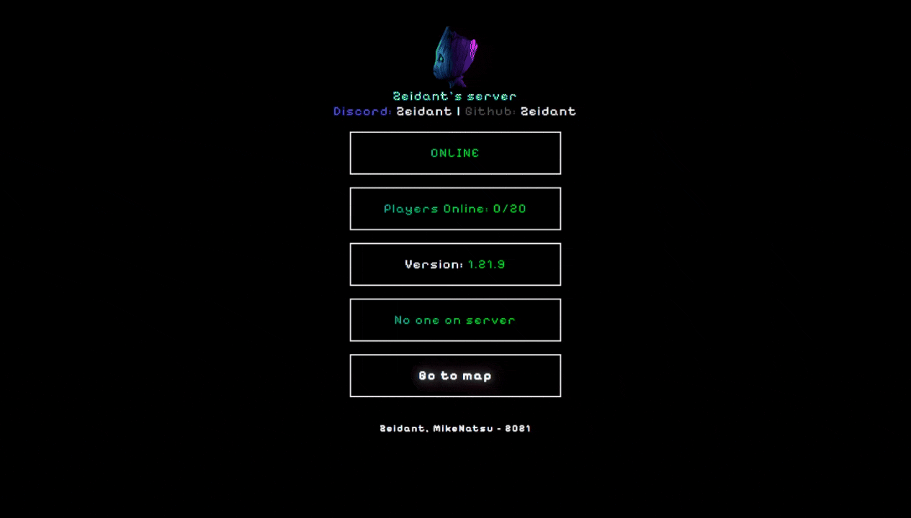

# 🌍 Minecraft Server Status — Zeidant Network



Una página web minimalista y animada para mostrar el estado **online/offline**, versión y jugadores de un servidor de **Minecraft Java Edition**, conectando con una API pública de estado de servidores.

> 💡 Este proyecto está desplegado en [Vercel](https://vercel.com/) y utiliza [Cloudflare DNS](https://www.cloudflare.com/) para manejar subdominios personalizados como `mc.zeidant.com` y `mundo.mc.zeidant.com`.

---

## 🚀 Características

- 🖤 Interfaz **oscura** y con **animaciones de texto arcoíris**.
- 🔌 Consulta el estado de tu servidor Minecraft en **tiempo real** mediante API.
- ⚡ Muestra:
  - Estado del servidor (Online / Offline)
  - Versión del servidor
  - Jugadores conectados
  - Nombres de los jugadores
  - Link al mapa dinámico [(Bluemap)](https://modrinth.com/plugin/bluemap)
- 🌩️ Compatible con **Cloudflare Tunnels** y subdominios personalizados.
- 💻 Desplegable fácilmente en **Vercel**, **Netlify** o cualquier hosting estático.

---

## 🧩 Estructura del proyecto

```
/
├── assets/
│   ├── icon.png
│   ├── profile-picture.jpg
│   └── styles.css
├── static/
│   └── main.js
├── index.html
└── README.md
```

---

## ⚙️ API utilizada

Este proyecto usa la API pública de **[MC API (mcsrvstat.us)](https://api.mcsrvstat.us/)**:

**Ejemplo de endpoint:**
```
https://api.mcsrvstat.us/2/mc.zeidant.com
```

**Ejemplo de respuesta:**
```json
{
  "online": true,
  "motd": { "clean": ["Zeidant's Server"] },
  "players": {
    "online": 3,
    "max": 20,
    "list": ["MikeNatsu", "Zeidant", "Adoniscrak"]
  },
  "version": "1.21.9",
  "hostname": "mc.zeidant.com"
}
```

El archivo `main.js` procesa esta respuesta y actualiza dinámicamente los elementos del DOM:

```js
const serverUrl = "https://api.mcsrvstat.us/2/mc.zeidant.com";

fetch(serverUrl)
  .then(res => res.json())
  .then(data => {
    if (!data.online) {
      document.getElementById("onlineStatus").textContent = "🔴 Server Offline";
      hideInfo();
      return;
    }

    document.getElementById("onlineStatus").textContent = "🟢 Server Online";
    document.getElementById("versionServer").innerHTML = `Versión: <span class="rainbow_text_animated">${data.version}</span>`;
    document.getElementById("playersCounter").innerHTML = `Jugadores: <span class="rainbow_text_animated">${data.players.online}/${data.players.max}</span>`;
  });

function hideInfo() {
  ["playersCounter", "versionServer", "playersName", "worldLink"].forEach(id => {
    document.getElementById(id).style.display = "none";
  });
}
```
---

## 🖥️ Despliegue en Vercel

1. Crea una cuenta gratuita en [vercel.com](https://vercel.com).
2. Importa este repositorio desde GitHub.
3. Vercel detectará automáticamente un proyecto estático.
4. Pulsa **Deploy**.
5. Asigna un dominio personalizado (por ejemplo `status.zeidant.com`).

---

## 🧪 Despliegue local

```bash
git clone https://github.com/zeidant/mc-server-status.git
cd mc-server-status
```
Luego simplemente abre `index.html` en tu navegador.

---

## 🎨 Personalización

Puedes cambiar fácilmente:

- 🎨 **Colores y animaciones** → `assets/styles.css`
- 🔠 **Tipografía** → Google Fonts (`Pixelify Sans` o `VT323`)
- 📸 **Imagen del servidor** → `assets/profile-picture.jpg`
- 🌍 **Mapa dinámico** → Enlace en `#worldLink`
- ⚙️ **Dominio de la API** → en `static/main.js`

---

## 🧰 Tecnologías usadas

| Tecnología | Uso |
|-------------|-----|
| **HTML5 + CSS3** | Estructura y estilo |
| **JavaScript** | Consumo de API y DOM dinámico |
| **MC API (mcsrvstat.us)** | Datos del servidor Minecraft |
| **Vercel** | Hosting y CDN |
| **Cloudflare** | DNS, Túnel y SSL |

---

## 🌐 Sitio en vivo

> <h1>👉<a href="https://mc.zeidant.com">MC server status</a></h1>

## 🧑‍💻 Autor  
<table>
  <tr>
    <td align="center">
      <a href="https://github.com/zeidant">
        <br>
        <sub><b>Anthony Feliz (@zeidant)</b></sub>
      </a>
      <br>
      🎮 Desarrollador de Software<br>
      🌐 <a href="https://zeidant.com">https://zeidant.com</a>
    </td>
  </tr>
</table>


## ⭐ Si te gusta este proyecto, deja una estrella en GitHub 😄